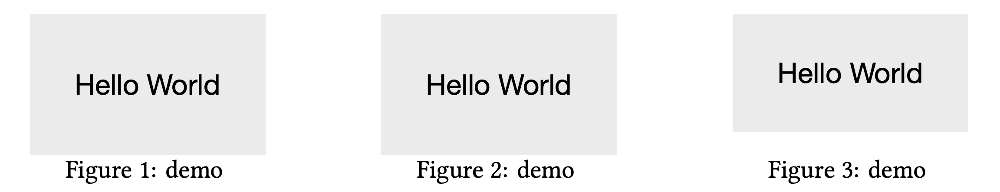

# Easysubfig

Easysubfig is a useful LaTeX snippet for creating subfigures. Sometimes you have a series of figures with different heights, and you want to align them at the bottom or top. When you use the minipage environment, the images are aligned based on the baseline of the first line of the minipage or the last line of the minipage (t or b option). What we want is to align the subfigures **based on the baseline of the first line of the caption**, and to be able to add spacing below the image to adjust the height. Easysubfig allows you to do this.

Easysubfig allows you to add custom spacing between the image and the caption. For example figure 3 adds a spacing of 10pt between the image and the caption.

```tex
\begin{figure}[h]
    \easysubfig[caption={demo \label{fig:1}}, width={0.33\textwidth}]{figs/demo.pdf}%
    \easysubfig[caption={demo \label{fig:2}}, width={0.33\textwidth}]{figs/demo.pdf}%
    \easysubfig[caption={demo \label{fig:3}}, width={0.33\textwidth}, spacing=10pt]{figs/demo2.pdf}%
\end{figure}
```



**Arranging multiple subfigures side by side is very common in many conference papers. Feel free to use this code to save yourself from the hassle of constantly adjusting subfigures.**

## Usage

Add the following code to your LaTeX preamble:

```tex
\usepackage{graphicx}
\usepackage{caption}

\makeatletter
\define@key{easysubfig}{width}{\def\csf@width{#1}}
\define@key{easysubfig}{spacing}{\def\csf@spacing{#1}}
\define@key{easysubfig}{caption}{\def\csf@caption{#1}}

\NewDocumentCommand{\easysubfig}{O{} m}{%
  \begingroup%
  \setkeys{easysubfig}{width=\textwidth,spacing=0pt,#1}%
  \begin{minipage}[t]{\csf@width}
    \begin{minipage}[b]{\textwidth}
        \centering
        \includegraphics{#2} \\
        \vspace{\csf@spacing}
    \end{minipage}%
    \captionsetup{width=.9\linewidth, skip=0pt}
    \caption{\csf@caption}
  \end{minipage}%
  \endgroup%
}
\makeatother
```
